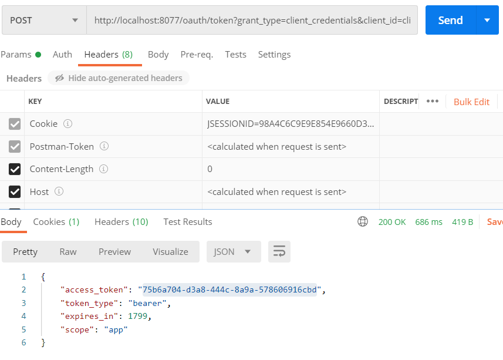
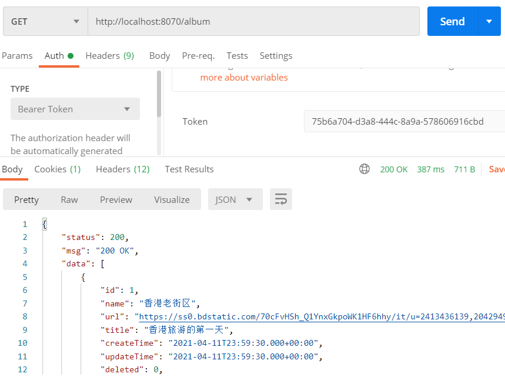
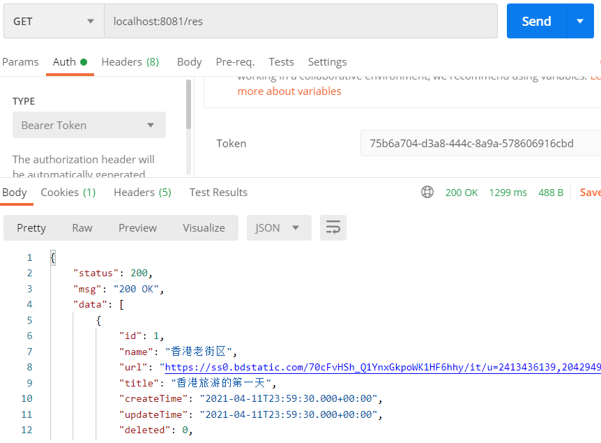

# SpnringCloud请求组件在OAuth2的应用

## Feign挂上BearerToken请求头

- 认证服务器业务

``` java
@RequestMapping("/pass")
public MyToken getPassToken(@RequestParam String username, @RequestParam String password) throws UserPrincipalNotFoundException {
    //String clientId = userService.getClientId(username, new BCryptPasswordEncoder().encode("vue"));
    vUser users = userService.getByUserName(username);
    if(users==null) throw new UserPrincipalNotFoundException("找不到该用户");
    oauthClientDetails allByClientId = myClientDetailsService.getAllByClientId(users.getClientId());
    String clientId = users.getClientId();
    String clientSecret = "sec";
    String host = "http://localhost:"+port;
    String type = "client_credentials";
    return new RestTemplate()
        .getForObject(host + "oauth/token?grant_type=" + type + "&client_id=" + clientId + "&client_secret=" + clientSecret + "&scopes=app",
            MyToken.class);
}
```

- 资源服务器业务

``` java
@CrossOrigin(allowedHeaders = {"Authorization"})
@GetMapping("/album")
public ResponseResult<List<vongCover>> pages(){
    return new ResponseResult<List<vongCover>>(Integer.valueOf(HttpStatus.OK.value()), HttpStatus.OK.toString(), vongCoverService.selectAll());
}
```

- 客户端业务

 ``` java
@Resource
GetResService getResService;
 
@RequestMapping("/res")
public ResponseResult<List<vongCover>> getPassToken(@RequestHeader(value = HttpHeaders.AUTHORIZATION,required = false) String authentication){
    return getResService.pages(authentication);
}
 ```
 
 - 客户端请求资源服务器
 ``` java
@Service
@FeignClient(name = "vong-base")
public interface GetResService {
    @GetMapping("/album")
    public ResponseResult<List<vongCover>> pages(@RequestHeader(value = HttpHeaders.AUTHORIZATION,required = false) String authentication);
}
 ```

# 测试结果

- 认证结果



- 资源访问



- 客户端访问



## Gateway筛选有参请求并挂上请求头


